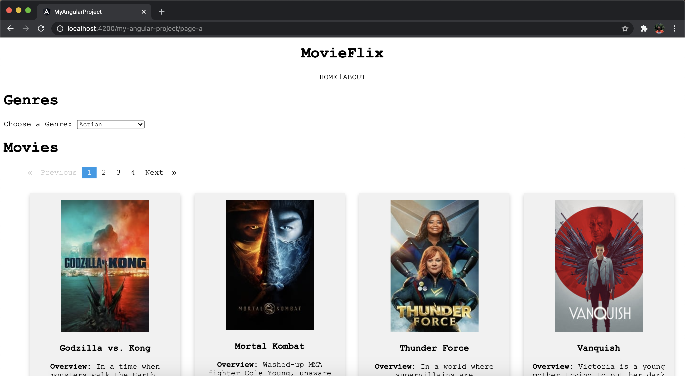

# Movie App

Project developed during the Angular course held at the BCIT institution in the Applied Web Development program. The purpose of this project was to develop an App similar to Netflix using API, where the user can select the movies by genres.

